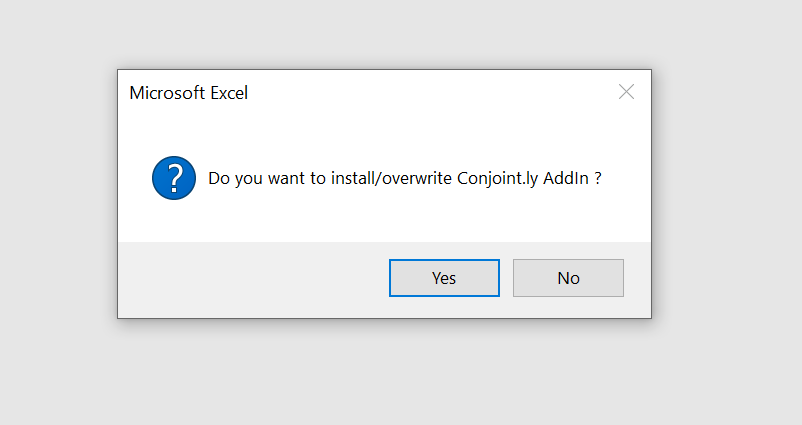

# Conjoint.ly Excel plugin
A free companion plugin for Excel that helps with charting [Conjoint.ly](https://conjointly.com/) outputs, including simulations charts from the Conjoint.ly [online simulator](https://conjointly.com/guides/conjoint-preference-share-simulator/) (scenario modelling and [price elasticity](https://conjointly.com/guides/understanding-price-elasticity-of-demand/) charts), colouring for [TURF analysis](https://conjointly.com/blog/turf-analysis/), and other useful utility functions.

#### Installation Guide (Windows 10)

To install the plugin first download the file by selecting ConjointlyExcelPlugin-v2.xlam, then clicking the button Download. 

Once the file is downloaded, move the file to an apropriate location in your file system. Rename the file to ConjointlyExcelPlugin-v2.install.

Right click on the file and select properties. At the bottom of the pop up box is the option to unblock the file. Select unblock and then apply.

Once this is completed, close all current instances of Microsoft Office. By double clicking on the file you will be prompted with the following message. 

Select Yes to confirm the installation. To confirm that the program has installed successfully, check that the tab Conjoint.ly now appears at the top of your screen.

##### Optional Step - Previous Conjoint.ly Plugin Installed 
If you have installed the Conjoint.ly Plugin before September 2020, you will need to disable the exisiting plugin.

To do this, navigate to `Options` - `Excel Add-ins`. Select `Go` in the bottom left hand corner of the screen.

You will now have `Conjointlyexcelplugin.Xlam` installed as well as `Conjointlyexcelplugin`. Deselect the non xlam variant

#### Functionality

- **Conjoint.ly website link**
- **Formatting**:

  - **Make solid table**: Draw solid borders around      all selected cells and will make the top row text bold
  - **Centre across cells**: Place the text from the      first cell across all empty cells in that row without merging the cells
  - **Kill custom styles**: Remove all customs cell      styles
  - **Re-colour chart from cells:** Re-colour the selected      chart based on cell background colours

- **Trace for a range**: You know how you can trace     precedents and dependents for one cell in Excel? These buttons let you     check precedents and dependents for a range. These functions only find     precedents and dependents within the sheet. These functions do not show     arrows, but instead select the precedents and dependents.

- **Error handling**:

  - **Wrap formula in IF statement:** Select a range of cells      and click the button -> A self-explanatory series of dialogues will as      you how you want to convert a statement like =A1 into      =IF(A1=4,"FOUR",A1).
  - **Find Ref:** Click the button -> Selects cells that      are showing “#REF!”
  - **Format as error check range**: Select your error check      cells and click button to add conditional formatting: FALSE will be made      red, NA will be faded, TRUE and other values will be untouched
 - **Make all errors red on sheet**: Add conditional formatting to all cells on the sheet so that if there is an error (e.g., =8/0), the error cell will be red
