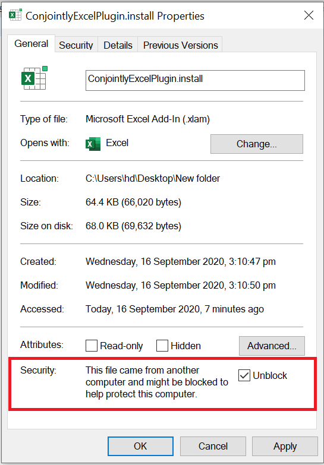
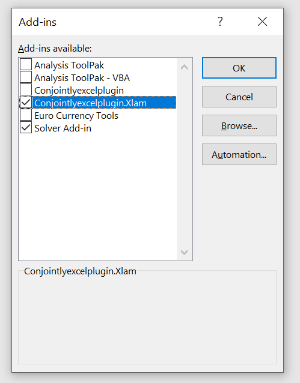

# Conjoint.ly Excel plugin
A free companion plugin for Excel that helps with charting [Conjoint.ly](https://conjointly.com/) outputs, including simulations charts from the Conjoint.ly [online simulator](https://conjointly.com/guides/conjoint-preference-share-simulator/) (scenario modelling and [price elasticity](https://conjointly.com/guides/understanding-price-elasticity-of-demand/) charts), colouring for [TURF analysis](https://conjointly.com/blog/turf-analysis/), and other useful utility functions.

### Installation Guide (Windows 10)

To install the plugin first download the file by selecting ConjointlyExcelPlugin-v2.xlam, then clicking the button Download. 

Once the file is downloaded, move the file to an apropriate location in your file system. Rename the file to ConjointlyExcelPlugin-v2.install.

Right click on the file and select properties. At the bottom of the pop up box is the option to unblock the file. Select unblock and then apply.

Once this is completed, close all current instances of Microsoft Office. By double clicking on the file you will be prompted with the following message. 

Select Yes to confirm the installation. To confirm that the program has installed successfully, check that the tab Conjoint.ly now appears at the top of your screen.

##### Optional Step - Previous Conjoint.ly Plugin Installed 
If you have installed the Conjoint.ly Plugin before September 2020, you will need to disable the exisiting plugin.

To do this, navigate to `Options` - `Excel Add-ins`. Select `Go` in the bottom left hand corner of the screen.

You will now have `Conjointlyexcelplugin.Xlam` installed as well as `Conjointlyexcelplugin`. Deselect the non xlam variant

### Functionality

| Button | Functionality |  
| ---------------------|--------------------------------------------------------------|
| **Go to Conjoint.ly** | Opens the user's default browser and redirects to [Conjoint.ly](https://conjointly.com/) |
| **Make solid table** | Draw solid borders around all currently highlighted cells. The text in the top row will be bolded.|
| **Centre across cells** | Place the text from the first cell across all selected cells. This gives the apparence of merged cells, but when referencing the cells only the first cell will contain a value, the rest will be empty.|
| **Re-colour chart from cells** | To use this function, first change the background colour of your data cells to the colour you wish to be displayed for that range on your chart. Selecting the chart and then the button will open a prompt where you can select how you want the colours to be applied. Once the options are selected, the colours will be applied to your chart. The font will also be changed to Helvetica Neue 11pt. |
| **Add Index with Links** | | 
| **Hide Zeros** | |
| **Lock conditional formatting** | |
| **Trace for a range** | You know how you can trace     precedents and dependents for one cell in Excel? These buttons let you     check precedents and dependents for a range. These functions only find     precedents and dependents within the sheet. These functions do not show     arrows, but instead select the precedents and dependents.|
